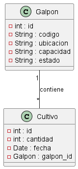

# Control y seguimiento Distribuciones Avícola. 

#### Necesidad:  Se tiene una granja de cultivo de pollos y se requiere desarrollar un sistema que permita controlar el tiempo de cada galpón. Para ello, se debe registrar para cada galpón el `código`, el `número de ubicación` y la `capacidad de pollos` que puede albergar. Además, se debe tener en cuenta el estado de ocupación del galpón, el cual puede estar `marcado como "usado" o "vacío".` Cuando lleguen nuevos pollos, se deberá ingresar la `cantidad`, la `fecha` y actualizar el `estado` del galpón según corresponda.


#### Análisis: Definición de requerimientos. 

1. RF1: 
2. RF1: 
3. RF1: 

1. RNF1: 
2. RNF1: 
3. RNF1: 

#### Diseñar Base de Datos
Datos a tener en cuenta

| código | Ubicación | Capacidad | Cantidad |  Fecha   | Estado |
|--------|-----------|-----------|----------|----------|--------|
| 101    |C-101      |2500       |0         |          | False  |
| 102    |C-102      |2400       |2000      |17-04-2024| True   |
| 112    |B-112      |600        |600       |17-04-2024| False  |
| 112    |B-112      |600        |400       |20-05-2024| True   |

* De lo anterior, se puede resaltar lo siguiente, si bien es cierto, se puede ingresar los datos sin normalización, se sabe que es necesario para la optimización y traza de los datos. 

En este sentido, se procede a normarlizar de la siguiente manera. 

* La clasificación de los galpones, estos son individuales. 

`galpon`
| id |código | Ubicación | Capacidad |Estado     |
|----|-------|-----------|-----------|-----------|
|  1 |101    |C-101      |2500       |True       |
|  2 |102    |C-102      |2400       |True       |
|  3 |112    |B-112      |600        |False      |
|  4 |112    |A-112      |1600       |False      |

* Se conoce que inicio de un cultivo, se requiere de la disponibilidad del galpon. Al Asignar un grupo de pollos al galpon, se debe `ocupar` el galpo  

`Cultivo`
| id    | Cantidad |  Fecha     | GalponId | 
|-------|----------|------------|----------|
|   1   | 1200     | 17-04-2024 |   4      |
|   2   | 600      | 17-04-2024 |   3      |
|   3   | 400      | 20-5-2024  |   3      |


> Ver


> Script de la base de datos
```sql
    DROP DATABASE IF EXISTS cultivo;

    CREATE DATABASE cultivo;

    USE cultivo;

    CREATE table galpon(
        id INT NOT NULL PRIMARY KEY AUTO_INCREMENT,
        codigo VARCHAR(50) NOT NULL UNIQUE,
        ubicacion VARCHAR(50) NOT NULL,
        capacidad INT NOT NULL,
        estado BIT DEFAULT TRUE
    ); 

    CREATE table cultivo(
        id INT NOT NULL PRIMARY KEY AUTO_INCREMENT,
        cantidad VARCHAR(50) NOT NULL,
        fecha DATE NOT NULL,
        galpon_id INT NOT NULL,
        FOREIGN KEY (galpon_id) REFERENCES galpon(id)
    ); 
```
# Ver planificación 
[Ver Aquí](https://trello.com/b/gOEix3Zs/control-y-seguimiento-distribuciones-avicola)
